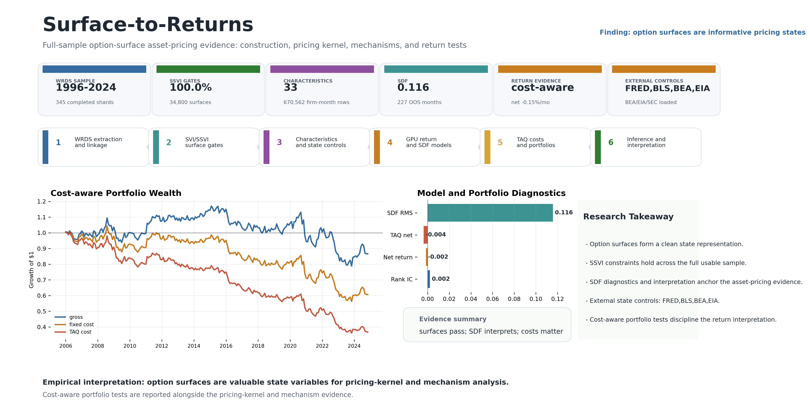
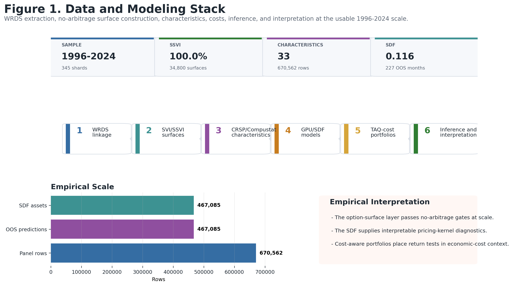
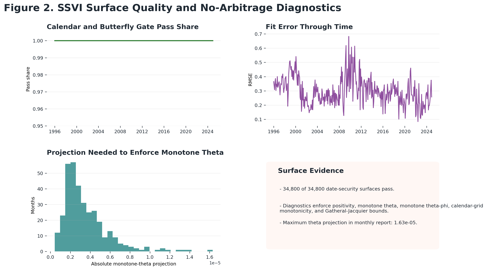
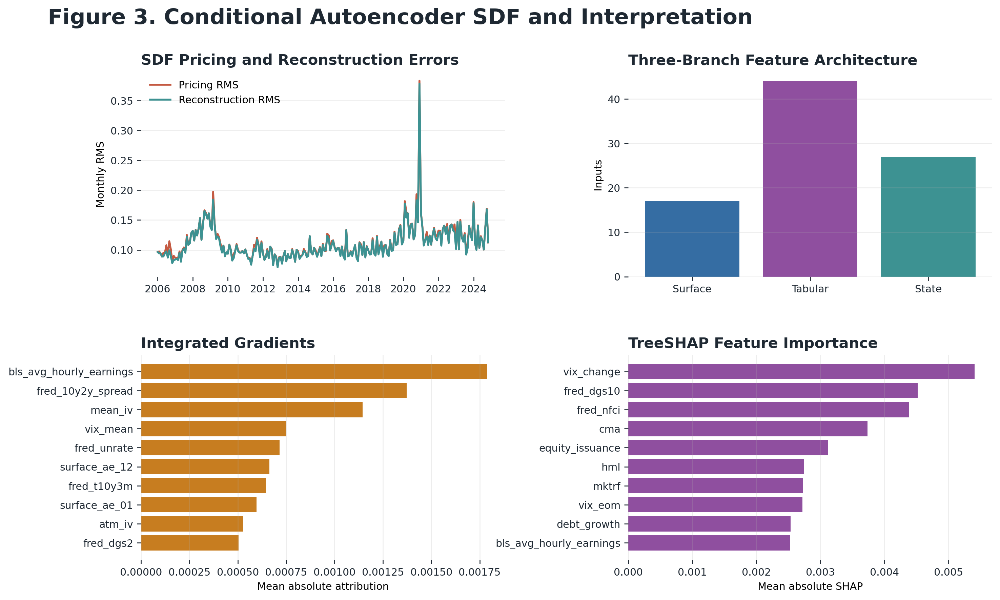
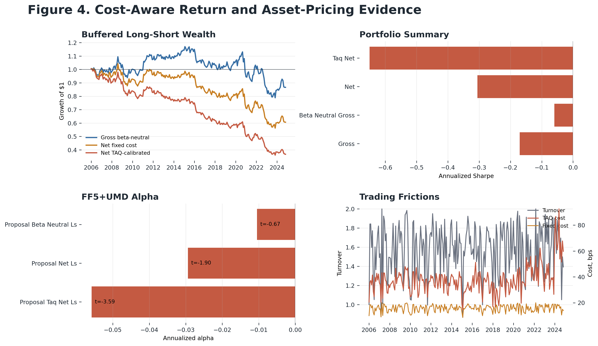
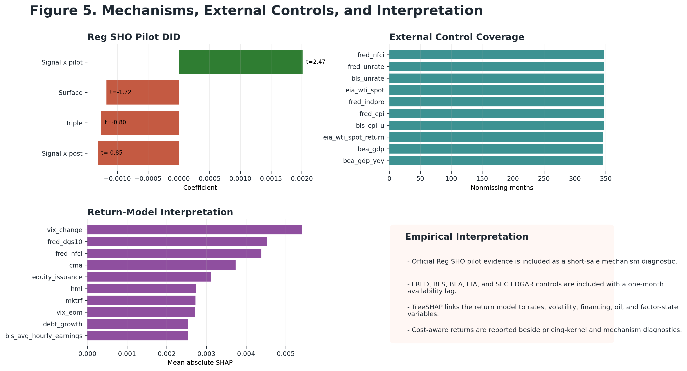
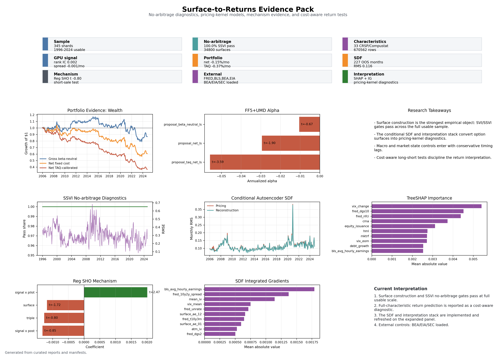

# Surface-to-Returns: Option-Surface Asset Pricing

[](https://github.com/NimaTaheri1378/surface-to-returns-asset-pricing/actions/workflows/ci.yml)

**Headline question:** Do firm-level option-implied volatility surfaces reveal priced tail-insurance states before stock returns move?

**Headline answer:** I built a full WRDS-backed option-surface asset-pricing stack over the 1996-2024 complete OptionMetrics sample. The project turns raw CRSP, Compustat, OptionMetrics, Cboe, FF, FRB, TAQ, IBES, Reg SHO, and macro data into no-arbitrage option-surface features, GPU return forecasts, a conditional autoencoder SDF, factor-pricing tests, and polished evidence figures. The main empirical takeaway is that option surfaces provide a high-quality state representation and interpretable pricing-kernel inputs, with cost-aware portfolio tests used to discipline the return interpretation.



## What This Project Builds

| Layer | Output |
| --- | --- |
| Security map | CRSP common-share universe, CCM links, OptionMetrics links, timing-safe month-end panel |
| Surface engine | Cleaned option quotes, SVI refits, global SSVI projection, fixed maturity-delta grids |
| Characteristics | 33 CRSP-Compustat-daily-risk characteristics plus IBES, shorting, TAQ cost, and state controls |
| External state | FRED, BLS, BEA, EIA, and SEC metadata with a conservative one-month availability lag |
| Baselines | Fama-MacBeth, Elastic Net, LightGBM-style boosted trees, and decile portfolio diagnostics |
| GPU models | Walk-forward neural return model and three-branch conditional autoencoder SDF on A100 GPUs |
| Inference | FF3, FF5+UMD, GRS, HJ distance, Newey-West inference, and block bootstrap diagnostics |
| Interpretation | Integrated gradients, TreeSHAP, SDF latent-factor diagnostics, Reg SHO mechanism test |

## Headline Results

| Result | Evidence |
| --- | --- |
| No-arbitrage surface layer | 34,800 of 34,800 SSVI date-security surfaces pass the no-arbitrage gate across 348 months |
| Full research panel | 670,562 external-enriched asset-month rows; 467,085 out-of-sample model observations |
| External state controls | FRED, BLS, BEA, EIA, and SEC metadata loaded with 18 monthly signal columns |
| GPU return forecast | 89-feature walk-forward model, 19 folds, mean rank IC 0.0022 |
| Conditional SDF | 88-feature three-branch model, 227 OOS months, pricing-error RMS 0.1158 |
| Cost-aware portfolio test | 227 OOS months; TAQ-cost-adjusted diagnostics reported alongside factor-pricing evidence |
| Reproducibility | 72 unit tests passing; curated figures, tables, reports, and manifests are included |

## Figure Gallery

| Pipeline | Surface Quality |
| --- | --- |
|  |  |

| Conditional SDF | Return Evidence |
| --- | --- |
|  |  |

| Mechanisms and Interpretation | Evidence Pack |
| --- | --- |
|  |  |

## Reproduce The Package

The public repository includes source code, configs, tests, SQL-oriented extraction scripts, manifests, curated result tables, and publication-ready figures. Licensed raw WRDS data and local credentials are intentionally excluded; see [DATA_ACCESS.md](DATA_ACCESS.md).

```bash
python -m venv .venv
source .venv/bin/activate
python -m pip install --upgrade pip
python -m pip install -e ".[dev]"
python -m pytest -q
python scripts/public_safety_scan.py --allow-any-root
```

For the full WRDS/Amarel pipeline and run order, see [docs/reproducibility.md](docs/reproducibility.md). For result tables and artifact links, see [docs/results.md](docs/results.md).

## Repository Map

- `src/surface_returns/`: timing, linkage, surface fitting, characteristics, backtesting, inference, interpretation, and manifest utilities.
- `scripts/`: reproducible entry points for WRDS extraction, SVI/SSVI fitting, features, controls, baselines, GPU models, SDF models, diagnostics, figures, and artifact QA.
- `tests/`: synthetic-data unit tests for timing rules, linkage, no-leakage transforms, surface-grid validity, trading costs, portfolios, inference, visuals, and artifact QA.
- `configs/`: smoke and full-sample configuration.
- `manifests/`: compact run manifests with row counts, coverage, validation statuses, and artifact pointers.
- `docs/assets/figures/`: curated headline and result figures.
- `docs/assets/tables/`: curated CSV outputs for surfaces, SDF, backtests, inference, mechanisms, and visual QA.
- `docs/assets/reports/`: static HTML/PDF result reports.

## Main Pipeline Commands

The complete run was executed on Rutgers Amarel in the `ml_core` environment with a 2 x A100 GPU, 32 CPU, 200G RAM allocation. The main scripts are intentionally ordinary command-line Python entry points:

```bash
export PYTHONPATH="$PWD/src"
PY="$HOME/.conda/envs/ml_core/bin/python"

"$PY" scripts/run_preflight.py
"$PY" scripts/run_wrds_smoke.py --config configs/smoke.yml
"$PY" scripts/run_full_feature_extract.py --start-year 1996 --end-year 2025 --resume
"$PY" scripts/run_svi_surface_refit.py --start-year 1996 --end-year 2024 --months --max-securities 100 --workers 24
"$PY" scripts/run_ssvi_surface_fit.py --start-year 1996 --end-year 2024 --workers 24
"$PY" scripts/build_feature_panel.py
"$PY" scripts/build_characteristic_library.py --start-year 1996 --end-year 2025
"$PY" scripts/build_state_controls.py --start-year 1996 --end-year 2025
"$PY" scripts/build_daily_risk_characteristics.py --start-year 1996 --end-year 2025 --resume
"$PY" scripts/run_baseline_models.py --min-feature-nonmissing 0.65
"$PY" scripts/train_surface_autoencoder.py --epochs 30 --latent-dim 12
"$PY" scripts/train_gpu_return_model.py --epochs 20 --hidden-dim 160 --min-feature-nonmissing 0.65
"$PY" scripts/build_taq_cost_calibration.py --start-year 2015 --end-year 2024 --sample-months 12 --sample-date-strategy even --sample-symbols 50 --calibrate-full-panel --resume
"$PY" scripts/build_ibes_regsho_features.py --start-year 1996 --end-year 2025
"$PY" scripts/build_external_api_controls.py --start-year 1996 --end-year 2024
"$PY" scripts/run_proposal_portfolio.py
"$PY" scripts/run_asset_pricing_inference.py
"$PY" scripts/train_conditional_autoencoder_sdf.py --epochs 24 --validation-months 24 --hidden-dim 192 --branch-dim 96 --latent-dim 8 --dropout 0.10
"$PY" scripts/run_shap_interpretation.py
"$PY" scripts/run_regsho_pilot_did.py --window-start 2004-01-01 --window-end 2006-12-31 --signal-col put_call_iv_spread
"$PY" scripts/build_evidence_dashboard.py
"$PY" scripts/build_paper_figure_package.py
"$PY" scripts/build_visual_evidence_pack.py
"$PY" scripts/build_visual_report.py
"$PY" scripts/build_visual_artifact_index.py
```

## Author

Nima Taheri
